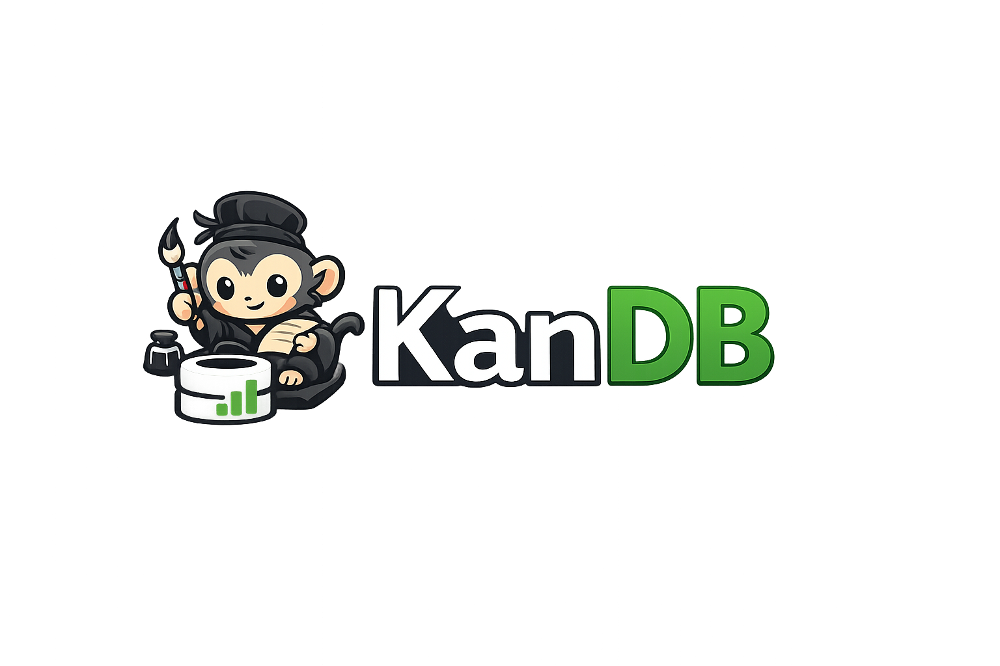

# kanDB

English | [简体中文](./README.zh-CN.md)



A lightweight database viewer and manager for a fast, focused desktop workflow.

> kanDB is currently in an early stage. The repository is still a bootstrap project, and the product direction described here is the intended roadmap rather than a list of completed features.

## Overview

kanDB is a desktop database viewer and manager built with Rust and GPUI. It is designed to make database work feel lightweight, quiet, and direct, with an interface centered on browsing data, inspecting structure, and handling focused data tasks without the weight of a full IDE-style tool.

## Why kanDB

The `kan` in kanDB comes from the Chinese character “看”, which means “to look” or “to see”. The name reflects the core idea behind the product: a database tool should help you see your data quickly and clearly.

## The Ink Monkey

kanDB uses the ink monkey as its mascot and brand motif. In traditional stories, the ink monkey is a tiny creature that helps with simple desk work such as grinding ink and passing paper. That makes it a good fit for kanDB: a small tool that stays out of the way while helping you handle database work on the desktop.

## Product Direction

kanDB is meant to be a focused desktop client rather than a heavy all-in-one environment. The goal is a tool you can open quickly, understand immediately, and use for common data inspection and management tasks without unnecessary complexity.

## Near-term Roadmap

- Connection management for local and remote databases
- Schema, table, and record browsing
- Query execution with a fast read-and-iterate workflow
- Lightweight record viewing and editing flows
- A responsive desktop interaction model built around speed and clarity

## Tech Direction

kanDB is being built in Rust with GPUI. The intent is to combine native performance with a desktop UI that feels focused and efficient for developer workflows.

## Current Development Status

The repository currently contains the initial Rust project scaffold. As implementation begins, the README will evolve alongside the product.

To run the current project locally:

```bash
cargo run -p kandb
```
